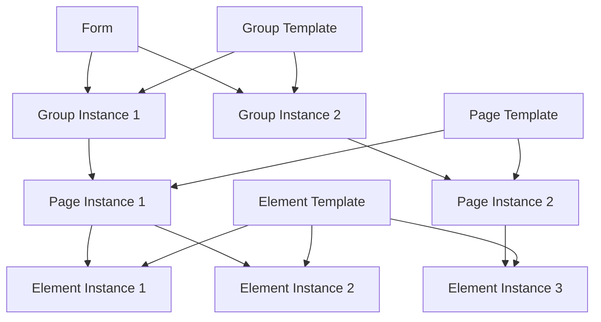

# Form Builder Database Schema

This document provides a comprehensive overview of the database schema for our advanced form builder application. The schema is designed to support a flexible, reusable, and powerful form building system with PostgreSQL and Drizzle ORM.

## Table of Contents

- [Form Builder Database Schema](#form-builder-database-schema)
  - [Table of Contents](#table-of-contents)
  - [Architecture Overview](#architecture-overview)
  - [Template-Instance Pattern](#template-instance-pattern)
  - [Core Entities](#core-entities)
    - [Template Entities](#template-entities)
    - [Instance Entities](#instance-entities)
    - [Form Entities](#form-entities)
    - [Supporting Entities](#supporting-entities)
  - [Entity Relationships](#entity-relationships)
  - [Key Features](#key-features)
    - [Form Versioning](#form-versioning)
    - [Form Publishing Workflow](#form-publishing-workflow)
    - [Form Forking](#form-forking)
    - [Validation System](#validation-system)
    - [Conditional Logic](#conditional-logic)
  - [Schema Implementation](#schema-implementation)
    - [Benefits of PostgreSQL with Drizzle](#benefits-of-postgresql-with-drizzle)
  - [JSON Structure Examples](#json-structure-examples)
    - [Element Validation (in element instances)](#element-validation-in-element-instances)
    - [Form-level Validation](#form-level-validation)
    - [Conditional Logic](#conditional-logic-1)
    - [Properties Override Example](#properties-override-example)
  - [Common Workflows](#common-workflows)
    - [Creating a New Form](#creating-a-new-form)
    - [Publishing a Form](#publishing-a-form)
    - [Handling Form Submissions](#handling-form-submissions)
    - [Example: Same Element with Different Validations](#example-same-element-with-different-validations)

## Architecture Overview

The form builder implements a flexible and reusable component-based architecture. Key design features include:

- **Template-Instance Pattern**: Clear separation between definitions (templates) and usages (instances)
- **Hierarchical Structure**: Forms contain groups, groups contain pages, pages contain elements
- **Reusability**: Templates can be reused across multiple contexts with different configurations
- **Versioning**: Forms are versioned to maintain integrity over time
- **Extensible Properties**: JSONB fields allow for flexible properties without schema changes

## Template-Instance Pattern

The system uses a template-instance pattern, where:

- **Templates** define the base structure and properties of a component
- **Instances** represent a specific usage of a template with potential overrides
- **No direct usage** of templates occurs - all form components are instances

This pattern enables:

- Reusing elements across multiple pages with different validations
- Reusing pages across multiple forms with different configurations
- Tracking element changes while maintaining form integrity



## Core Entities

The schema consists of these primary entities:

### Template Entities

- **Element Templates**: Reusable form elements (text inputs, checkboxes, etc.)
- **Page Templates**: Collections of related elements
- **Group Templates**: Collections of related pages

### Instance Entities

- **Element Instances**: A specific usage of an element with context-specific validations
- **Page Instances**: A specific usage of a page with potential overrides
- **Group Instances**: A specific usage of a group with potential overrides

### Form Entities

- **Forms**: The top-level container that represents a complete form
- **Form Versions**: Point-in-time snapshots of a form's complete structure
- **Form Publish Audits**: Records of publishing events

### Supporting Entities

- **Form Validations**: Cross-field validation rules
- **Conditions**: Rules for showing/hiding components based on responses
- **Submissions**: End-user form responses
- **Change Log**: Audit trail of schema changes

## Entity Relationships

The following diagram illustrates the relationships between entities:

```
Form
 ├── Form Versions (snapshots at publish time)
 ├── Form Publish Audits
 ├── Form Validations
 ├── Conditions
 └── Group Instances
      └── Page Instances
           └── Element Instances
                └── Element Template (reference)
```

## Key Features

### Form Versioning

Forms are versioned to maintain integrity over time:

- Each form has a `currentVersion` that increments on publish
- Publishing creates a complete snapshot in `formVersion`
- Published forms cannot be structurally modified
- New changes require creating a new version
- Submissions are linked to specific form versions

### Form Publishing Workflow

1. Forms start in `draft` status
2. While in draft, the form structure can be modified
3. Publishing:
   - Creates a version snapshot
   - Updates status to `published`
   - Records audit information
4. Published forms cannot be unpublished or structurally modified
5. To make changes, a new draft version must be created

### Form Forking

Forms can be forked to create derivatives:

- A new form is created with references to the original form (`forkedFromId`)
- All related instances are cloned
- Template references are preserved
- The forked form starts in `draft` status
- A record of the original form and fork date is maintained

### Validation System

Two levels of validation are supported:

1. **Element-level validation**:

   - Stored in the `validations` field of each element instance
   - Uses JSON Logic format for flexible validation rules
   - Can vary for the same element template in different contexts

2. **Form-level validation**:
   - Stored in the `formValidation` table
   - Validates across multiple fields (e.g., "sum equals 100%")
   - References affected element instances

### Conditional Logic

Conditional logic controls the visibility of form components:

- Stored in the `condition` table
- Uses JSON Logic format for condition rules
- Can target elements, pages, or groups
- Supports `show` or `hide` actions based on form responses

## Schema Implementation

The schema is implemented using PostgreSQL with Drizzle ORM:

```typescript
// Template tables
export const elementTemplate = createTable("element_template", {
  id: text("id").primaryKey().notNull(),
  type: elementTypeEnum("type").notNull(),
  label: text("label").notNull(),
  defaultValue: text("default_value"),
  properties: jsonb("properties").$type<ElementProperties>().default({}),
  createdAt: timestamp("created_at").notNull().defaultNow(),
  updatedAt: timestamp("updated_at").notNull().defaultNow(),
});

// Instance tables
export const elementInstance = createTable("element_instance", {
  id: text("id").primaryKey().notNull(),
  templateId: text("template_id")
    .notNull()
    .references(() => elementTemplate.id),
  pageInstanceId: text("page_instance_id")
    .notNull()
    .references(() => pageInstance.id),
  orderIndex: integer("order_index").notNull(),
  required: boolean("required").notNull().default(false),
  labelOverride: text("label_override"),
  propertiesOverride: jsonb("properties_override").$type<ElementProperties>().default({}),
  validations: jsonb("validations").$type<ValidationRule[]>().default([]),
  createdAt: timestamp("created_at").notNull().defaultNow(),
  updatedAt: timestamp("updated_at").notNull().defaultNow(),
});

// Form and versioning
export const form = createTable("form", {
  id: text("id").primaryKey().notNull(),
  title: text("title").notNull(),
  description: text("description"),
  status: formStatusEnum("status").notNull().default("draft"),
  currentVersion: integer("current_version").notNull().default(1),
  forkedFromId: text("forked_from_id").references(() => form.id),
  forkDate: timestamp("fork_date"),
  createdAt: timestamp("created_at").notNull().defaultNow(),
  updatedAt: timestamp("updated_at").notNull().defaultNow(),
  createdBy: text("created_by"),
  properties: jsonb("properties").$type<Record<string, any>>().default({}),
});

// Validation and conditional logic
export const formValidation = createTable("form_validation", {
  id: text("id").primaryKey().notNull(),
  formId: text("form_id")
    .notNull()
    .references(() => form.id),
  name: text("name").notNull(),
  rule: jsonb("rule").notNull(),
  errorMessage: text("error_message").notNull(),
  affectedElementInstances: jsonb("affected_element_instances").$type<string[]>(),
  createdAt: timestamp("created_at").notNull().defaultNow(),
  updatedAt: timestamp("updated_at").notNull().defaultNow(),
});

export const condition = createTable("condition", {
  id: text("id").primaryKey().notNull(),
  formId: text("form_id")
    .notNull()
    .references(() => form.id),
  name: text("name"),
  rule: jsonb("rule").notNull(),
  action: conditionActionEnum("action").notNull(),
  targetType: targetTypeEnum("target_type").notNull(),
  targetId: text("target_id").notNull(),
  createdAt: timestamp("created_at").notNull().defaultNow(),
  updatedAt: timestamp("updated_at").notNull().defaultNow(),
});
```

### Benefits of PostgreSQL with Drizzle

- **Type Safety**: TypeScript type inference for all database operations
- **JSONB for Flexibility**: Schema-less JSON fields for properties and rules
- **Relational Integrity**: Foreign key constraints maintain data consistency
- **PostgreSQL Features**: Efficient indexing of JSON fields, custom operators
- **Migration Support**: Drizzle provides tools for schema migrations

## JSON Structure Examples

### Element Validation (in element instances)

```json
{
  "validations": [
    {
      "type": "jsonLogic",
      "rule": {
        ">": [{ "var": "" }, 0]
      },
      "error_message": "Value must be greater than zero"
    },
    {
      "type": "jsonLogic",
      "rule": {
        "in": [{ "var": "" }, ["option1", "option2", "option3"]]
      },
      "error_message": "Please select a valid option"
    }
  ]
}
```

### Form-level Validation

```json
{
  "name": "Total equals 100%",
  "rule": {
    "==": [
      { "+": [{ "var": "element_123" }, { "var": "element_456" }, { "var": "element_789" }] },
      100
    ]
  },
  "errorMessage": "The sum of all percentages must equal 100%",
  "affectedElementInstances": ["element_123", "element_456", "element_789"]
}
```

### Conditional Logic

```json
{
  "name": "Show address fields if shipping requested",
  "rule": {
    "==": [{ "var": "element_123" }, "yes"]
  },
  "action": "show",
  "targetType": "group",
  "targetId": "group_456"
}
```

### Properties Override Example

```json
{
  "placeholder": "Enter your company name",
  "min": 2,
  "max": 100,
  "options": ["Option A", "Option B", "Option C"],
  "customClass": "company-field"
}
```

## Common Workflows

### Creating a New Form

1. Create a form record in `draft` status
2. Create group instances with references to group templates
3. Create page instances with references to page templates
4. Create element instances with references to element templates
5. Add form-level validations and conditions as needed

### Publishing a Form

1. Create a complete snapshot of the form structure
2. Save the snapshot in `formVersion`
3. Create a record in `formPublishAudit`
4. Update the form status to `published` and increment `currentVersion`

### Handling Form Submissions

1. Load the published form and active version
2. Evaluate conditions to determine visibility
3. Collect and validate user input against validation rules
4. Store submitted data with reference to form version

### Example: Same Element with Different Validations

```typescript
// Create a number input element template
const emailTemplate = await db.insert(elementTemplate).values({
  id: "elem_email",
  type: "email",
  label: "Email Address",
  properties: {},
});

// Use in Page 1 (Contact Info) with basic validation
await db.insert(elementInstance).values({
  id: "elem_inst_1",
  templateId: "elem_email",
  pageInstanceId: "page_inst_contact",
  orderIndex: 1,
  required: true,
  validations: [
    {
      type: "jsonLogic",
      rule: { in: [{ var: "" }, [".com", ".org", ".edu"]] },
      error_message: "Please use a standard email domain",
    },
  ],
});

// Use in Page 2 (Work Info) with stricter validation
await db.insert(elementInstance).values({
  id: "elem_inst_2",
  templateId: "elem_email",
  pageInstanceId: "page_inst_work",
  orderIndex: 1,
  required: true,
  labelOverride: "Work Email Address",
  validations: [
    {
      type: "regex",
      rule: "^[a-zA-Z0-9._%+-]+@company\\.com$",
      error_message: "Please use your company email address",
    },
  ],
});
```

This schema provides a robust foundation for building a powerful, flexible form builder system that supports reuse, versioning, and complex validation logic while leveraging PostgreSQL's strengths through Drizzle ORM.
